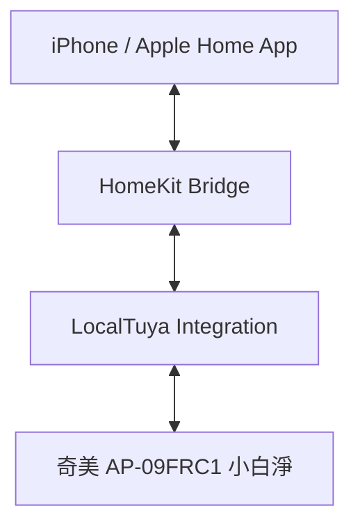

# Home Assistant 智慧家居配置備份 (LocalTuya)

## 系統架構


## 自動修復腳本 (YAML)
```yaml
alias: "智慧家電 LocalTuya 自動修復"
trigger:
  - platform: state
    entity_id: fan.can_ting_xiao_bai_jing
    to: "unavailable"
action:
  - service: homeassistant.reload_config_entry
    target:
      entity_id: fan.can_ting_xiao_bai_jing
```

## 設備 DP Code 配置 (AP-09FRC1)
- ID 1: 電源 (Switch/Fan)
- ID 2: 風速 (1-3)
- ID 5: PM2.5 (Sensor)
- ID 7: 左右擺頭 (Switch)
- ID 8: 上下擺頭 (Switch)

